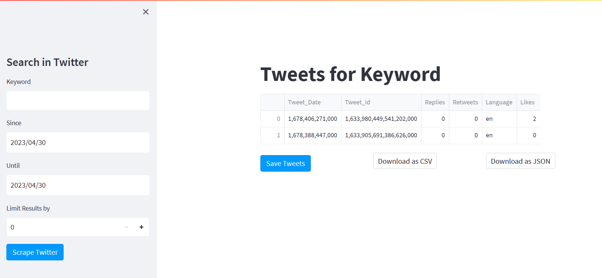

# TwitterScrape
Twitter Scraping using snScrape and Streamlit Packages
# Steps to make the code work
  1. Install Snscrape
  2. Install Pandas
  3. Install Streamlit
  
# How to run the application
1. Pull the repo
2. Install the packages
3. Go to the folder where the file is pulled.
4. Run the below command.
  streamlit run twitter_scrape.py
 

## Note: snscrape package stopped working. Hence created dummy data set to display, store in MongoDB, Download as JSON, CSV.
